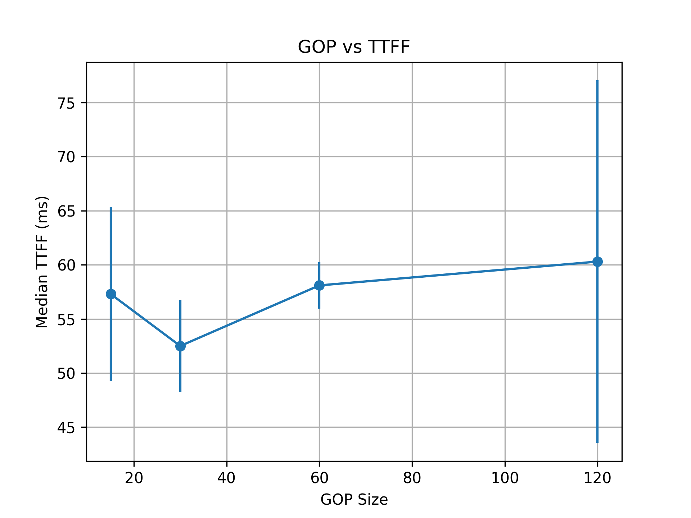

# GOP vs TTFF and Bandwidth Trade-off

## Objective

Evaluate how keyframe interval (GOP size) impacts:

1. Startup latency (TTFF)
2. Bandwidth cost (avg / P95 / peak)
3. Trade-off between latency stability and server bandwidth

---

## Experimental Environment

- OS: Windows
- Browser: Edge
- Playback: JSMpeg + Canvas (`disableGL: true`, 2D rendering for pixel detection)
- Transport: WebSocket (localhost)
- Video source: `test.mp4` (looped push)
- Streaming chain: `node stream-server.js test.mp4` + `http-server`
- Resolution: 1280×720
- FPS: 30

All non-variable parameters remain fixed.

---

## Variables

GOP values tested:

- 15
- 30
- 60
- 120

At 30 FPS:
- GOP 30 ≈ 1 second keyframe interval
- GOP 60 ≈ 2 seconds
- GOP 120 ≈ 4 seconds

For each GOP:
- TTFF measured with 5 page refreshes
- Bandwidth recorded over 60 seconds server-side

---

## Metrics

### Latency

- Median TTFF
- Mean TTFF
- Standard Deviation

### Bandwidth

- Average Mbps
- P95 Mbps
- Peak Mbps

Raw data available in:

`raw_data/gop_ttff.csv`

---

## Results

### Bandwidth Trend

As GOP increases from 15 → 120:

- Avg bandwidth decreases (~1.188 → ~1.023 Mbps, ≈ -14%)
- P95 bandwidth decreases (~ -10%)
- Peak bandwidth decreases (~ -12%)

This confirms that larger GOP reduces I-frame density and overall bitrate.

### TTFF Trend

TTFF does not decrease monotonically.

Observed median TTFF:

- GOP 15 → ~57 ms
- GOP 30 → ~52 ms (lowest)
- GOP 60 → ~58 ms
- GOP 120 → ~60 ms

GOP 120 shows higher variance due to a heavy-tail event (~95 ms).

---

## Interpretation

Under the FFmpeg + WebSocket + JSMpeg architecture:

1. GOP strongly influences bandwidth cost.
2. GOP has limited impact on typical TTFF.
3. TTFF is largely dominated by:
   - Browser-side initialization
   - WASM decoder startup
   - Canvas rendering pipeline
4. Larger GOP increases startup variability due to potential I-frame waiting.

GOP = 30 appears to provide a practical compromise between bandwidth efficiency and latency stability.