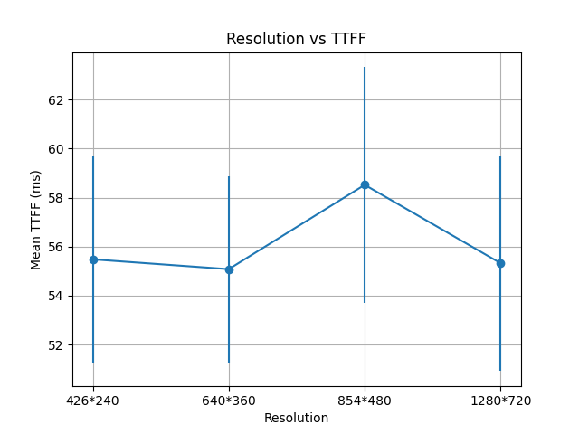

# Resolution vs TTFF

## Objective

Evaluate whether video resolution impacts browser-side startup latency (TTFF) under the FFmpeg + WebSocket + JSMpeg architecture.

TTFF is defined as:

TTFF = t_visible_frame − t_page_load

- t_page_load: `performance.now()` at page refresh
- t_visible_frame: first non-black pixel detected on Canvas

---

## Experimental Environment

- OS: Windows
- Browser: Edge
- Playback: JSMpeg + Canvas (`disableGL: true`, 2D rendering for stable pixel detection)
- Transport: WebSocket (localhost)
- Video source: `test.mp4` (looped push)
- Streaming chain: `node stream-server.js test.mp4` + `http-server`

All non-variable parameters remain fixed:
- FPS constant
- Bitrate constant
- Same PC
- Same browser
- Same network (localhost)

---

## Variables

Resolutions tested:

- 426×240
- 640×360
- 854×480
- 1280×720

For each resolution:
- Refresh page 5 times
- Record TTFF in Console

---

## Statistical Metrics

- Mean TTFF
- Standard Deviation

Raw data available in:

`raw_data/resolution_ttff.csv`

---

## Results

Observed mean TTFF:

- 426×240 → ~55.5 ms
- 640×360 → ~55.1 ms
- 854×480 → ~58.5 ms
- 1280×720 → ~55.3 ms

Fluctuations across repeated runs were comparable to variations across resolutions.

---

## Interpretation

Under the current FFmpeg + WebSocket + JSMpeg pipeline:

TTFF appears largely independent of resolution.

This suggests that decoding complexity and pixel processing cost are not dominant factors in startup latency.

Instead, TTFF is likely dominated by:

- First keyframe arrival
- Pipeline initialization
- WebSocket buffering
- WASM decoder startup
- Canvas rendering initialization

Resolution scaling does not significantly alter the first-frame delay in this architecture.